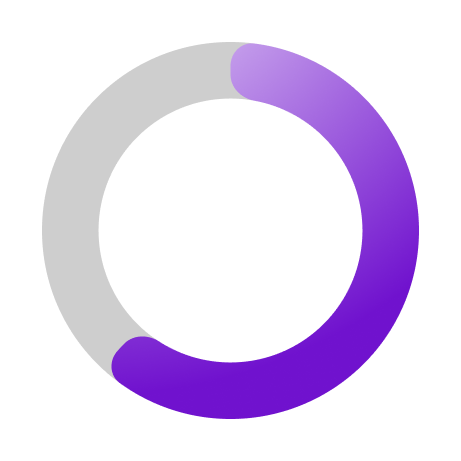

# 🎉 Internet Speed Test Application for macOS by Proxlight

  

Welcome to the **Internet Speed Test Application** by **Proxlight**! This macOS app allows you to check your download, upload, and ping speeds with a simple, clean interface designed for ease of use.

---

## 🚀 Features:
- **Check your Download Speed** in Mbps.
- **Measure your Upload Speed** in Mbps.
- **Get your Ping** in milliseconds.
- **Easy-to-Use Interface** optimized for fast results.

---

## 🖥️ Installation Instructions:

1. **Download the App**  
   Click the button below to download the `.app` file for macOS.

   

     
   

2. **Run the App**  
   After downloading, double-click the `.app` file to launch the Internet Speed Test application. If macOS displays a security warning, allow the app in your Security Preferences.

---

## 🎨 Want to Customize the App?

Unlock the **Pro Version** on Gumroad!  
In the Pro Version, you can:
- Access the full **Figma design file** for easy customization.
- Remove the watermark.
- Customize fonts, colors, and layout to fit your style or brand.

  👉 [Get the Pro Version Here](https://proxlightapps.gumroad.com/l/Speedtest)

---

## 📥 Download Options

- **Free Version**: Includes core features with a watermark.
- **Pro Version**: Fully customizable via Figma, no watermark.

**Download your preferred version and start testing your internet speed today!**

---

## 🛠️ Support

For any issues or questions, contact us at **proxlight02@gmail.com**.  
Thank you for using the **Internet Speed Test App** by **Proxlight**!

